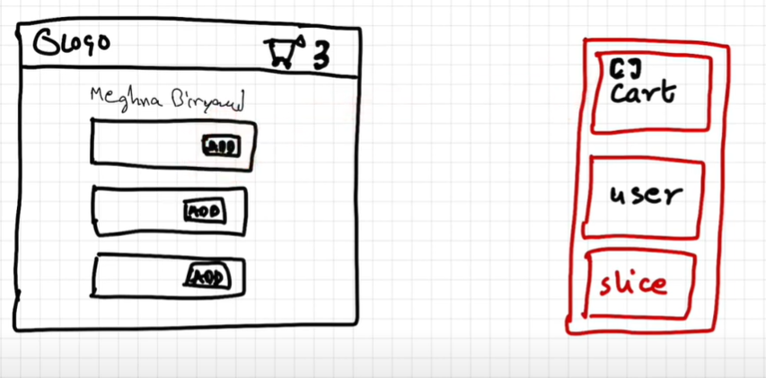
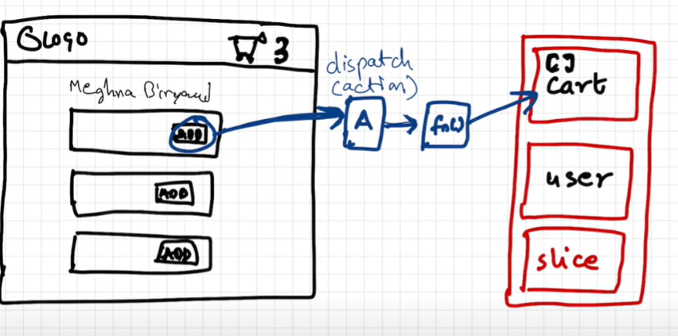
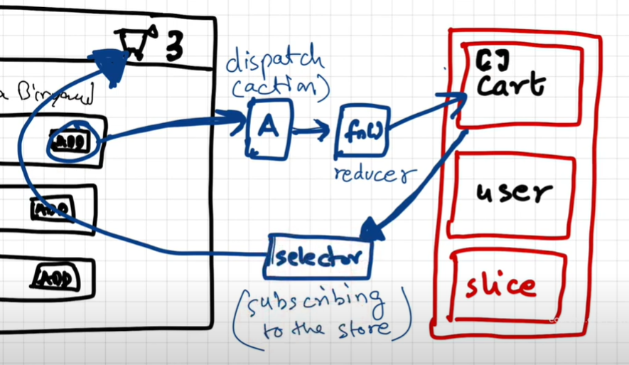
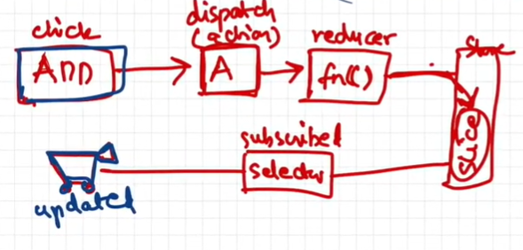

# Redux

Generally used for managing the state of our applications.  
It offers easy debugging.  
There are 2 libraries that redux team offers - <b>react-redux</b> & <b>redux-toolkit</b>.

Redux store is kind of like a big javascript object with lot of data kept inside it and its kept in a global central place. You can asume slice to be a small portion of the redux store.

Suppose we have made a cart slice. Redux says that you can't directly modify your cart slice.  
When you click on the add button, it dispaches an action, which calls a reducer function, which then modifies the slice in the store.

Now this was about how to write data in the slice. But how do we actually read the data inside the slice?  
We will use something known as a <b>selector</b>, to read the data from the store and modify the react component.  
And this phenomenon is known as <b>subscribing to the store</b>. So our header component has subscribed to the store, i.e., its in sync with the store. And it has subscribed to the store using a selector.

Summary :

## Steps :

1. Install `@reduxjs/toolkit` and `react-redux`.
2. Build the store (using configureStore()).
3. Connect the store to the app, using provider.
4. Create required slice/slices.
5. subscribing to the store using selectors.
