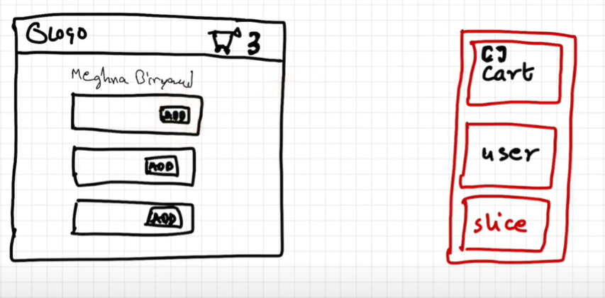

# Redux
Generally used for managing the state of our applications.  
It offers easy debugging.  
There are 2 libraries that redux team offers - <b>react-redux</b> & <b>redux-toolkit</b>.

Redux store is kind of like a big javascript object with lot of data kept inside it and its kept in a global central place. You can asume slice to be a small portion of the redux store.

  

